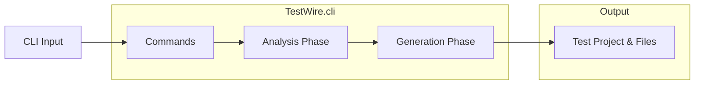
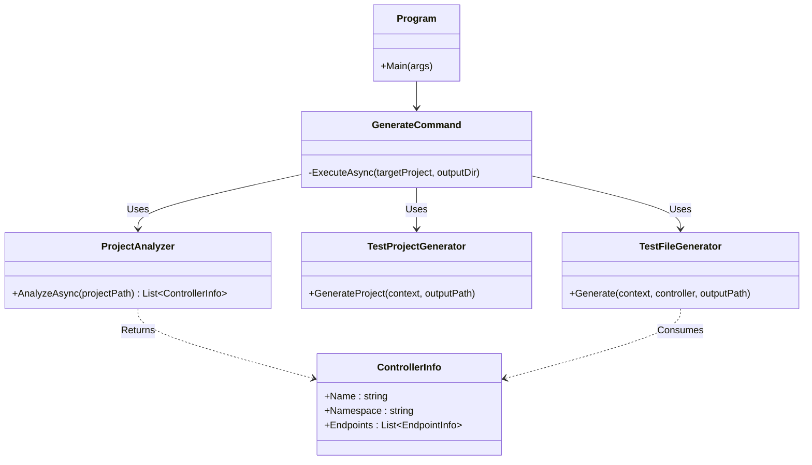
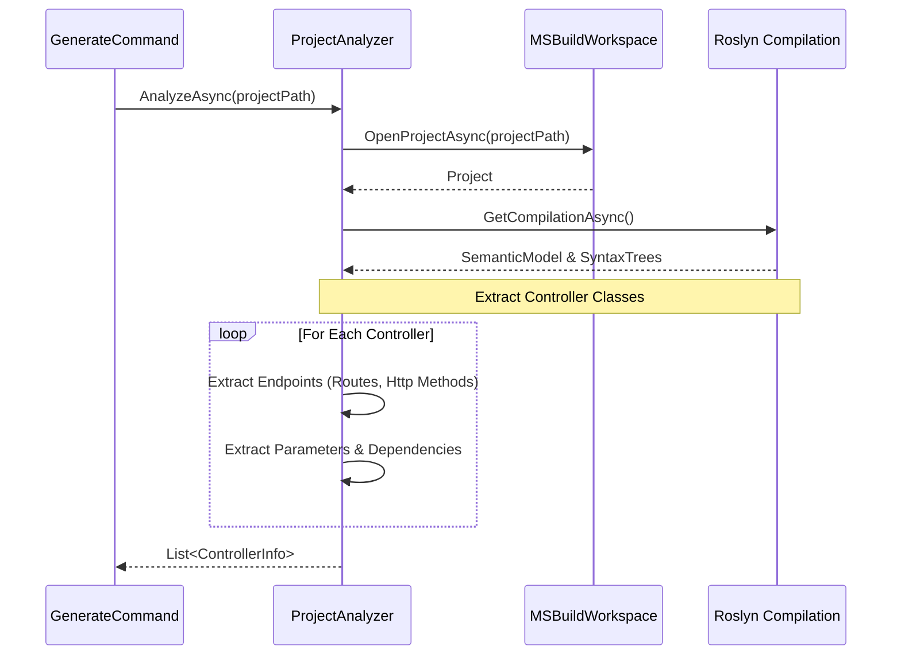
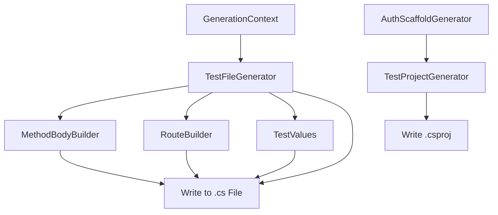

# TestWire Architecture

This document outlines the architecture of **TestWire**, a CLI tool for auto-generating integration test stubs for ASP.NET Core controllers.

## 1. High-Level Process Flow

TestWire operates in a simple, linear pipeline: parsing CLI arguments, analyzing the target project, generating the test structure, and writing the files.

## 2. Component Architecture

### Core Modules

TestWire is divided into three primary modules:
1. **Commands (`TestWire.cli.Commands`)**: Handles CLI argument parsing using `System.CommandLine` and coordinates the pipeline.
2. **Analysis (`TestWire.cli.Analysis`)**: Leverages Microsoft.CodeAnalysis (Roslyn) and MSBuildLocator to load the target `.csproj`, compile it, and extract controller metadata using syntax trees and semantic models.
3. **Generation (`TestWire.cli.Generation`)**: Takes the extracted metadata and generates C# test code using specific builders.

## 3. Analysis Phase Details

The Analysis phase uses Roslyn to deeply inspect the target ASP.NET Core project.

## 4. Generation Phase Details

The Generation module breaks down the code generation into specific builders for maintainability.

- **MethodBodyBuilder**: Generates the Arrange/Act/Assert blocks for each endpoint.
- **RouteBuilder**: Reconstructs the exact API route based on controller and action route attributes.
- **TestValues**: Provides mock data and default values for DTOs and parameters.
- **AuthScaffoldGenerator**: Generates authentication handlers/helpers for integration testing protected endpoints.
